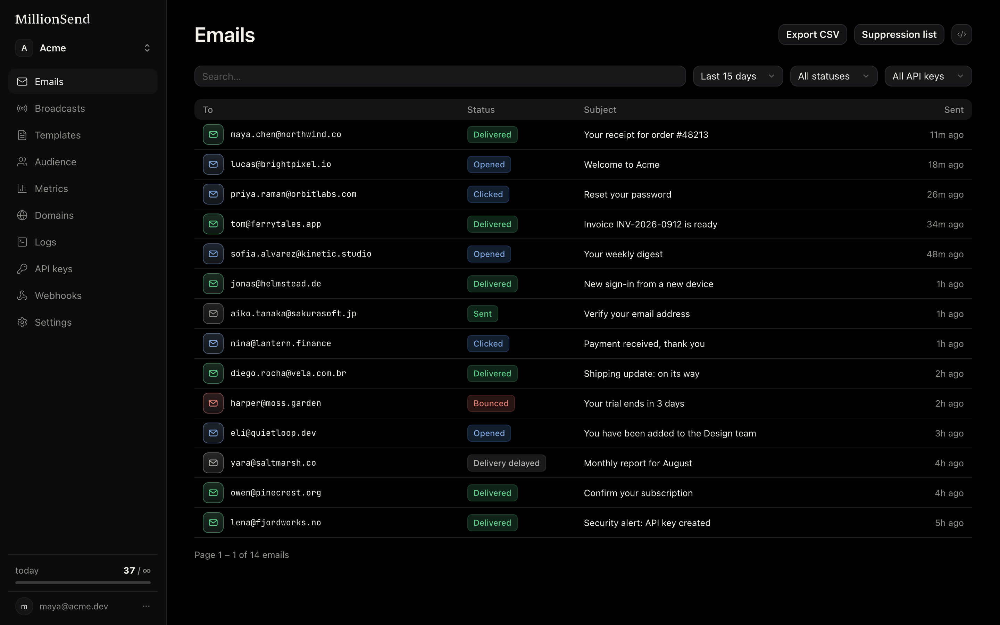

<p align="center">
  
</p>

<p align="center"><b>Transactional email with a Resend-compatible API.</b></p>

Self-host on your own AWS SES, or use the hosted cloud at
[mepmail.dev](https://mepmail.dev). Migrating from Resend means
changing two environment variables — not rewriting your integration.

<p align="center">
  
</p>

## Features

| Feature | Status | Notes |
| --- | --- | --- |
| Emails API (Resend-compatible) | ✅ | Send, batch, get, cancel — same request/response shapes as Resend. |
| Idempotency | ✅ | `Idempotency-Key` header dedupes retried sends. |
| API keys | ✅ | Create and revoke `ms_` keys from the dashboard, with last-used tracking. |
| Suppression list | ✅ | Hard bounces and complaints suppressed automatically; review and remove per address, or manage via `/suppressions` (batch add/remove up to 1000). |
| Metrics | ✅ | Daily sends with bounce and complaint rates tracked against SES thresholds. |
| Webhooks (Standard Webhooks) | ✅ | Signed event deliveries (`webhook-*` and `svix-*` headers) with per-endpoint event selection, a delivery log, and bring-your-own `whsec_` secret. |
| Domains + BYODKIM | ✅ | Guided DNS verification; bring your own DKIM key or let SES manage it. |
| Contacts | ✅ | Team-wide contacts with subscribe state, segments, topics, CSV import, and bulk `POST /contacts/batch`. |
| One-click unsubscribe (RFC 8058) | ✅ | `List-Unsubscribe` headers plus a hosted unsubscribe page. |
| Broadcasts | ✅ | Compose, schedule, and send to all contacts, a segment, or a topic; cancel while scheduled. |
| Templates + merge fields | ✅ | Reusable templates with per-contact merge fields; `/templates` API with per-team aliases. |
| API request logs | ✅ | Every API request recorded with request/response bodies, secrets redacted. |
| SMTP relay | ✅ | Drop-in SMTP on port 2587; authenticate with an API key. |
| Dashboard (en/pt-BR) | ✅ | Full dashboard in English and Brazilian Portuguese. |
| Self-host (Docker) | ✅ | Source-built Compose stack plus a setup wizard; sends through your own AWS SES. |
| Migrate from Resend | ✅ | `npx @mepmail/cli migrate --from resend` moves contacts, segments, topics, templates, webhooks, domains and suppressions; read-only against Resend, safe to re-run before cutover. |
| MCP for AI agents | ✅ | Hosted MCP server (`https://api-mepmail.je4ndev.com/mcp`, OAuth) and a local stdio server: `npx @mepmail/mcp`. |
| Agent discovery | ✅ | `/.well-known/ai-catalog.json`, `/llms.txt` and `/auth.md` served by the web app. |
| Docs (en/pt-BR) | ✅ | Full documentation at [docs.mepmail.dev](https://docs.mepmail.dev). |

## Run it locally

Build from this source checkout:

```sh
git clone https://github.com/JE4NVRG/mepmail.git mepmail
cd mepmail
cp .env.example .env
```

Fill the two required secrets in `.env` before boot (`MASTER_ENCRYPTION_KEY` and
`BETTER_AUTH_SECRET`; generate each with `openssl rand -base64 32`).

The supported installation path is a local source build (root `Dockerfile` /
`docker-compose.yml`); third-party installers or prebuilt images are not
supported release channels for this project. The source wizard (`pnpm setup:aws`)
and the full SES/SNS event pipeline are documented in the
[self-hosting guide](apps/docs/content/docs/self-hosting.mdx).

```sh
docker compose up --build -d
```

Dashboard at http://localhost:3000, API at http://localhost:3001.

## Migrating from Resend

Keep your Resend SDK: point its `baseUrl` at your MepMail instance and swap the
API key. The wire protocol is compatible, so request shapes do not change.

## MCP for AI agents

```sh
npx -y @mepmail/mcp   # stdio server for Claude Code, Cursor and any MCP client
```

## Links

- Cloud: [mepmail.dev](https://mepmail.dev)
- Docs: [docs.mepmail.dev](https://docs.mepmail.dev)
- API: [api.mepmail.dev](https://api.mepmail.dev)

## License

Code is licensed under [AGPL-3.0](LICENSE).

This project is derived from [MillionSend](https://github.com/MillionSend/millionsend);
attribution and notices live in `NOTICE.md`. The `@mepmail/mcp` server ships
under MIT. Upstream names, wordmarks and logos remain property of their
respective owners and are not licensed under the AGPL.
